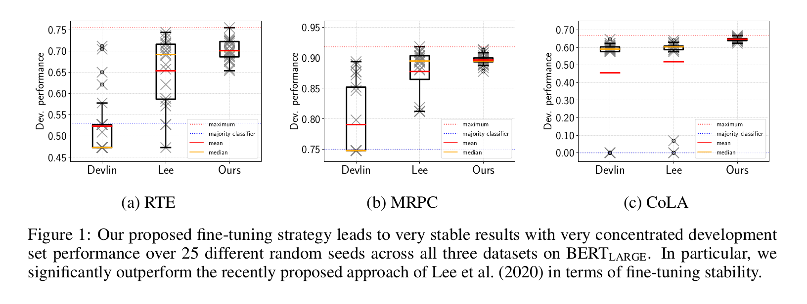
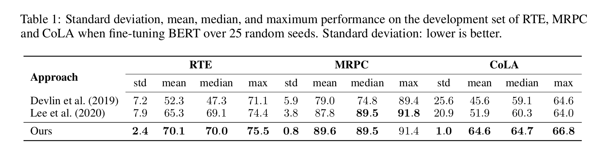

# On the Stability of Fine-tuning BERT: Misconceptions, Explanations, and Strong Baselines

### Marius Mosbach, Maksym Andriushchenko, Dietrich Klakow
##### Saarland University and EPFL

This repository contains code for the paper [On the Stability of Fine-tuning BERT: Misconceptions, Explanations, and Strong Baselines](https://arxiv.org/abs/2006.04884). It is a fork of the [Huggingface Transformers repository](https://github.com/huggingface/transformers) (v2.5.1).

## Abstract

Fine-tuning pre-trained transformer-based language models such as BERT has become a common practice dominating leaderboards across various NLP benchmarks. Despite the strong empirical performance of fine-tuned models, fine-tuning is an unstable process: training the same model with multiple random seeds can result in a large variance of the task performance. Previous literature (Devlin et al., 2019; Lee et al., 2020; Dodge et al., 2020) identified two potential reasons for the observed instability: catastrophic forgetting and a small size of the fine-tuning datasets. In this paper, we show that both hypotheses fail to explain
the fine-tuning instability. We analyze BERT, RoBERTa, and ALBERT, finetuned on three commonly used datasets from the GLUE benchmark and show that the observed instability is caused by optimization difficulties that lead to vanishing gradients. Additionally, we show that the remaining variance of the downstream task performance can be attributed to differences in generalization where fine-tuned models with the samw training loss exhibit noticeably different test performance. Based on our analysis, we present a simple but strong baseline that makes fine-tuning BERT-based models significantly more stable than previously proposed approaches.

## Reproducing our results

See `/examples/bert_stable_fine_tuning/README.md` for how to setup Docker and run our models. 
